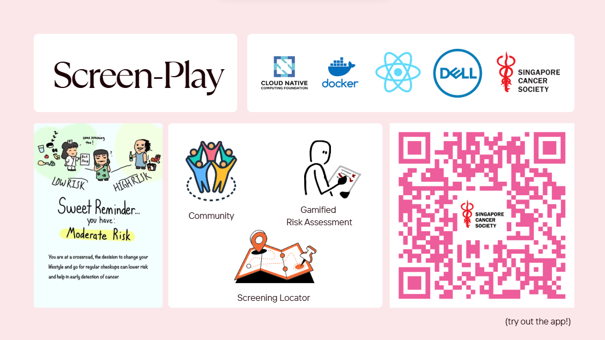
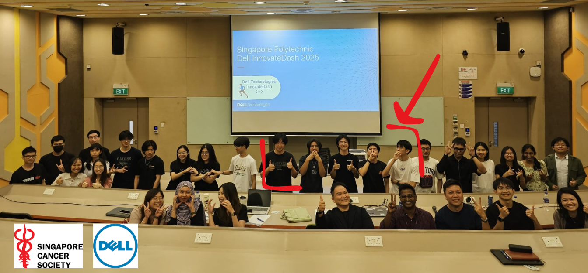
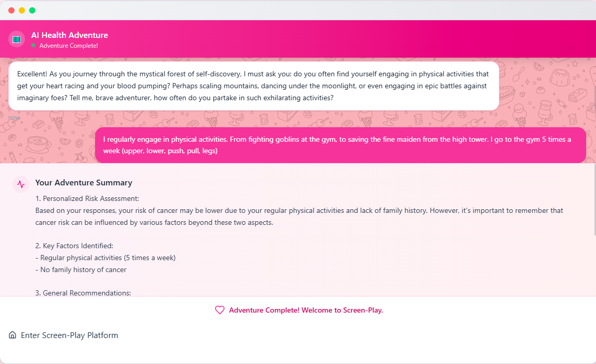
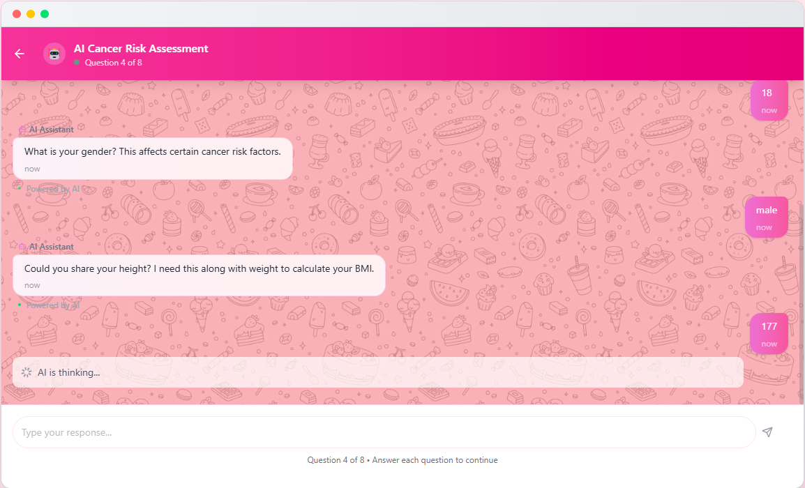
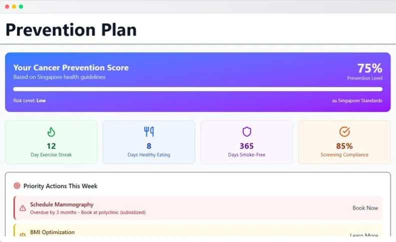
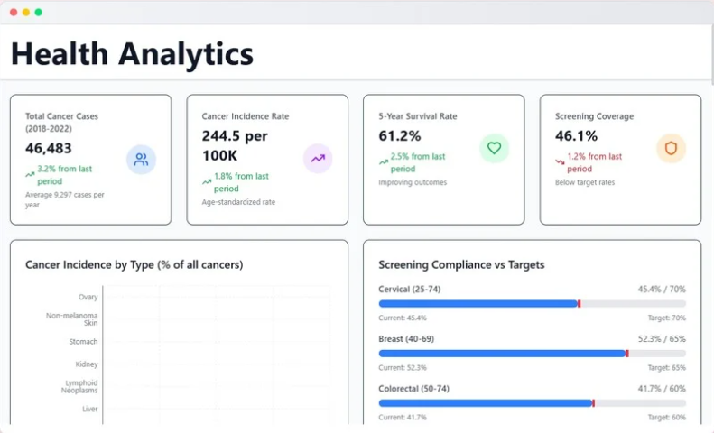
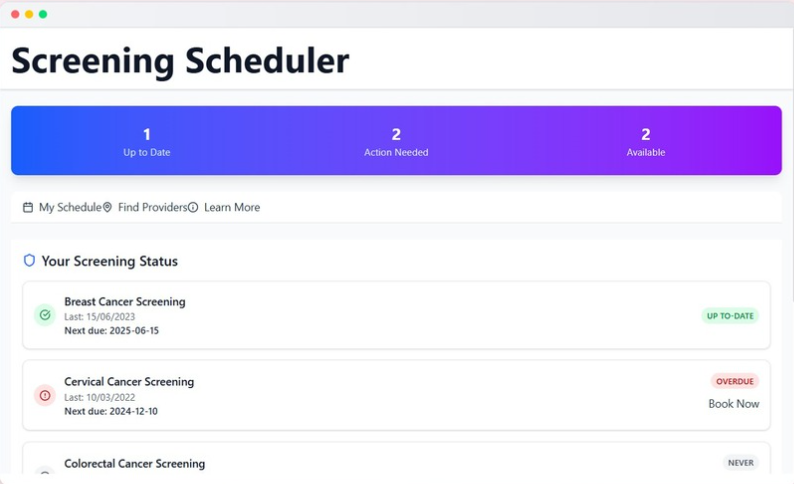
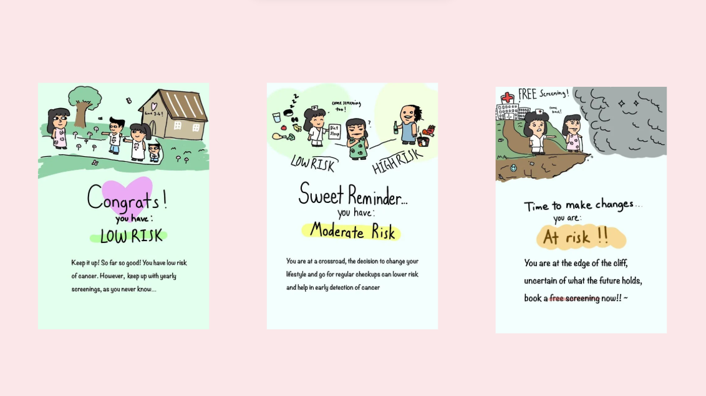
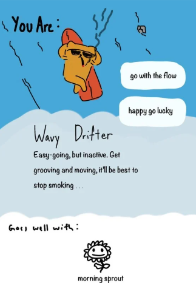
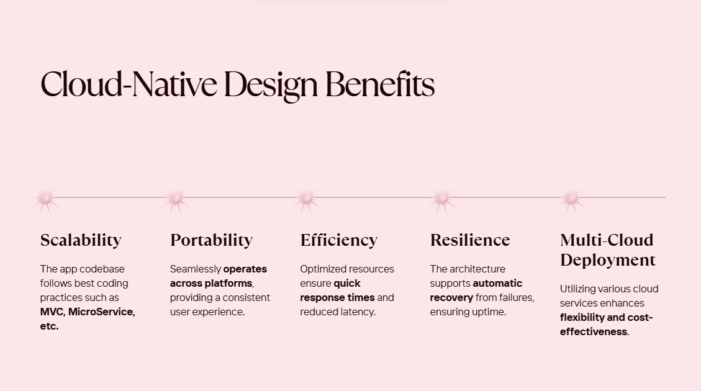

🌐 **Try out the deployed app!** [https://dell-innovatedash.vercel.app](https://dell-innovatedash.vercel.app)

**Screen-Play** is a gamified healthcare platform designed to spread cancer awareness and prevention through interactive experiences. Built for the Singapore Cancer Society, this application combines engaging gameplay with educational content to make cancer prevention accessible and shareable.

[](https://reactjs.org/)
[](https://vitejs.dev/)
[](https://www.docker.com/)
[](https://openai.com/)

<h4 align="center">
  <a href="https://www.canva.com/design/DAGsBTRidio/wDqbj2hA3rFUJIkd8D67_A/edit?utm_content=DAGsBTRidio&utm_campaign=designshare&utm_medium=link2&utm_source=sharebutton">Presentation Slides</a>
  <span> | </span>
  <a href="#app-features">Features</a>
  <span> | </span>
  <a href="#getting-started">Getting Started</a>
</h4>

---



*Developed for <b>Dell Innovate Dash Hackathon</b> at <b>Singapore Polytechnic</b> - <b>1st Runner Up</b>*

## Highlights

- **🏆 Achievement!!** 1st Runner Up at Dell Innovate Dash Hackathon
- Interactive quiz with personality-based cancer risk assessment
- Intelligent risk assessment using Artificial intelligence
- Docker containerization with Kubernetes-ready architecture
- Intuitive UI designed for both mobile and desktop with macOS-style interface
- Built to spread cancer awareness for Singapore Cancer Society

## App Features

| Feature | Description | Screenshot |
|---------|-------------|------------|
| **Interactive Text Adventure** | Engaging introduction experience that combines storytelling with health education to onboard users |  |
| **AI Risk Assessment Chatbot** | Interactive AI-powered chatbot that guides users through personalized cancer risk evaluation with intelligent conversation flow |  |
| **Cancer FAQ** | Comprehensive frequently asked questions section addressing common cancer concerns and providing reliable information |  |
| **Gamified Quiz Results** | Personality-based cancer risk results designed for social sharing and virality, making health awareness engaging and accessible |  |
| **Health Dashboard** | Comprehensive overview helping users find cancer screening resources, locate nearby screening centers, and receive personalized prevention recommendations |  |
| **Prevention Plan** | Tailored suggestions and actionable steps for cancer prevention based on individual risk factors and lifestyle |  |
| **Community Hub** | Social platform where users can connect, share goals, and motivate each other in their cancer prevention journey |  |
| **Health Analytics** | Detailed cancer statistics and insights to educate users about cancer trends and risk factors |  |
| **Screening Scheduler** | Smart scheduling system to track cancer screenings and suggest appropriate follow-up appointments |  |

## Personality Results




## Technical Architecture



**Screen-Play** is built with modern cloud-native principles:

- **Containerization**: Fully dockerized application for consistent deployment
- **Kubernetes Ready**: Structured for scalable orchestration
- **Microservices**: Modular architecture for maintainability
- **AI Integration**: Seamless OpenAI API integration for intelligent assessments
- **Responsive Design**: Adaptive UI that works across all devices

## 🚀 Getting Started

### Prerequisites
- Node.js v22.15.0 or later
- Docker
- Modern web browser

### Installation

1. **Clone the repository**
   ```bash
   git clone https://github.com/GabrielxKuek/dell-innovatedash.git
   cd client
   ```

2. **Install dependencies**
   ```bash
   npm install
   ```

3. **Run with Docker**
   ```bash
   docker-compose up
   ```

4. **Or run locally**
   ```bash
   npm run dev
   ```

5. **Open your browser**
   Navigate to `http://localhost:5173`

## 🛠️ Tech Stack

- **Frontend**: React + Vite
- **AI**: OpenAI
- **Containerization**: Docker
- **Architecture**: Cloud-Native, Kubernetes-ready
- **Styling**: TailwindCSS with macOS-inspired components

## 🏆 Achievements

- 🥈 **1st Runner Up** - Dell Innovate Dash Hackathon
- 🎯 **Finalist** - Singapore Polytechnic Dell Innovate Dash Hackathon
- 🤝 **Partnership** - Singapore Cancer Society Collaboration
- 🌟 **Impact** - Spreading cancer awareness through gamification

## 📈 Impact

Screen-Play addresses the critical need for cancer awareness in Singapore by:
- Making health information accessible and engaging
- Reducing barriers to cancer screening
- Building supportive communities around prevention
- Leveraging technology for social good